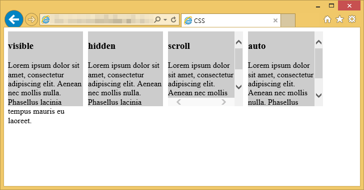
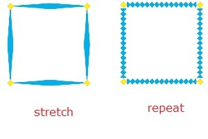
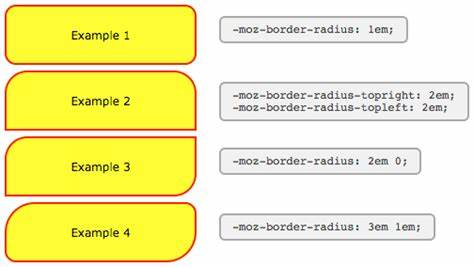

## Lists
* Numbered lists
* Bullet lists
* Definition lists

### when we need to use lists. HTML provides us with three different types:
1.   
        <ol> Ordered lists  
    
2. 
        <ul> Unordered lists

* Each item in the list is placed between an opening **<li>** tag and a closing **</li>** tag. (The **li** stands for list item.)   

3. 
        <dl>  definition list

* **<dl>** element you will usually see pairs of **<dt>** and **<dd>** elements.

    <dt> definition term

    <dd> contain the definition

## Nested Lists
* You can put a second list inside an **<li>** element to create a sublist or nested list.

~~like it:~~
* Mousses
* Pastries
  * Croissant 
  * Mille-feuille
  * Palmier
  * Profiterole
* Tarts

~~-------------------------------------------------------------~~
# Boxes

## Box Dimensions: 
  * width
  * height

## Limiting Width: 
  * min-width
  * max-width

## 3. Limiting Height:
  * min-height
  * max-height

## Overflowing Content
#### 1. overflow
#### 2. hidden
#### 3. scroll

## Border, Margin & Padding

## border-width
  * thin
  * medium
  * thick

        border-top-width
        border-right-width
        border-bottom-width
        border-left-width

## border-style

      border-top-style
      border-left-style
      border-right-style
      border-bottom-style

## border-color

      border-top-color
      border-right-color
      border-bottom-color
      border-left-color

## IE 6 Box Model

## Chance Inline/Block
* display
* inline
* block
* inline-block
* none

## Hiding Boxes
* visibility
* hidden
* visible

## border-image
* stretch
* repeat
* round

## box-shadow
* Horizontal offset
* Vertical offset
* Blur distance
* Spread of shadow

## border-radius

      border-top-right-radius
      border-bottom-right-radius
      border-bottom-left-radius
      border-top-left-radius
    

# ARRAYS in JavaScript

1. Create an array

2. Values in an ARRAYS

3. accessing & changing value in an array

        Create the array:
           var colors = ['white','black' , 'custom'];
        Update the third item in the array
            colors[2] = 'beige ' ;
        Get the element with an id of colors
            var el = document .getElementByid(' colors') ;
        Replace with third item from the array
            el .textContent = colors[2];

# IF ... ELSE STATEMENTS

# SWITCH STATEMENTS

        
### Type coercion & weak typing

| Data Type |Purpose|
|---|--|
|string| Text|
| number | Number|
| Boolean |true or false |
| nul | Empty value|
| undefined |Variable has been declared but not yet assigned a value| 

### TRUTHY & FALSY VALUES
* **Falsy values** if they are fa1se. 
  * Falsy values can also be treated as the number 0.

* **Truthy values** are treated as if they are true. 
  * Truthy values can also be treated as the number 1.

### Checking equality & existence

| EXPRESSION | RESULT|
|----|--|
|(false == 0)| true|
|(false === 0)|false |
|(false== ") |true|
|(false === ' ') |false|
|(0 :: I I)|true|
|(O === II)|false|
|(undefined ==null) |true|
|(null == false) |false|
|(undefi ned == false)| false|
|(null == 0)| false|
|(undefined == O)| false|
|(undefined === null)|false|
|(Nan == null)|false|
|(NaN == NaN)|false|

### Loops

