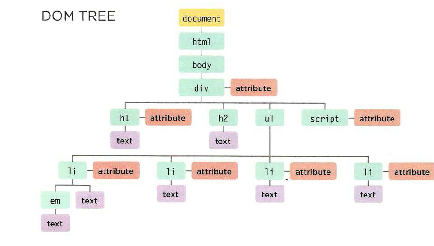

# Object Literals

## WHAT IS AN OBJECT?
* Objects group together a set of variables and functions to create a model of a something you would recognize from the real world. 
* In an object, variables and functions take on new names.

> in an object: variable become known as Properties.

>  in an object: function become known as method.

## Creating an object: Literal Notation
* Literal Notation is the easiest and most popular way to sreat objects.

## Accessing an object and dot notation
1. using dot notation.
2. square brakets.

## Creating objects using Literal Notation

## You can creating more objects Literal

---

# The Document Object Model (DOM) 
* specifies how browsers should create a model of an HTML page and how JavaScript can access and update the contents of a web page while it is in the browser window.

## The DOM tree is a model of a web page

* As a browser loads a web page, it creates a model of that page.
The model is called a DOM tree, and it is stored in the browsers' memory.
* It consists of four main types of nodes.

# Working with the DOM tree

### Accessing and updating the DOM tree involves two steps:
1. Locate the node that represents the element you want to work with.
2. Use its text content, child elements, and attributes.

#### Step1: Access the elements

1. select an individual element.
    * get Element Byld ()
    * query Se1ector ()
2. select multiple elements.
    * getElementsByClassName()
    * getElementsByTagName()
    * querySelectorAll()
3. traversing between element node.
    * parentNode
    * previousSibl ing / nextSibl ing
    * firstChild / lastChild

#### Step2: work with those elements
1. Access/ Update text nodes
    * nodeValue
2. work with HTML content
    * innerHTML
    * textContent
    * create Element()
    * createTextNode()
    * appendChild() / removeChild()
3. Access or Update attribute values
    * className /id
    * hasAttr i bute()
    * getAttribute()
    * setAttri bute()
    * removeAttribute()

## accessing elements
* DOM queries may return one element, or they may return a Nodelist,
which is a collection of nodes.

## Traversing the DOM.
1. parentNode
2. * previousSibling
   * nextSibling
3. * firstChild
   * lastChild

## How to get/update element content.

## DOM manipulation can be used to remove elements from the DOM tree.
1. STORE THE ELEMENT TO BE REMOVEDIN A VARIABLE
2. STORE THE PARENT OF THAT ELEMENTIN A VARIABLE
3. REMOVE THE ELEMENT FROM ITS CONTA NING ELEMENT

## XSS: VALIDATION & TEMPLATES
* Make sure that your users can only input characters they need to use and limit where this content will be shown on the page.

## XSS: ESCAPING & CONTROLLING MARKUP
* Any content generated by users that contain characters that are used in code should be escaped on the server. You must control any markup added to the page.

