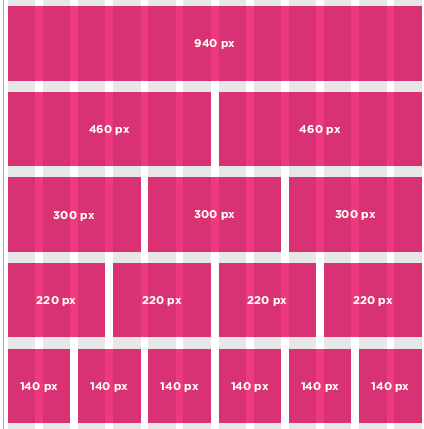

# Layout

## Key Concepts in Positioning Elements

### Building Blocks
* Block-level elements
    * start on a new line

        Examples: `<h1> 
 <ul> <li>`

* Inline elements
    * flow in between surrounding text

        Examples: ` <b> <i>`

* Containing Elements

* positioning schemes
    * normal flow
        * position:static
    * Relative Positioning
        * position:relative
    * Absolute positioning
        * position:absolute

* box offset
    * Fixed Positioning
        * position:fixed
    * Floating Elements
        * float
    * Overlapping Elements
        * z-index

* Clearing Floats
    * clear
    * left
    * right
    * both
    * none

* Creating Multi-Column Layouts with Floats
    * width
    * float
    * margin

* **Screen Sizes**
    * Different visitors to your site will have different sized screens that show different amounts of information, so your design needs to be able to work on a range of different sized screens.

* **Screen Resolution**
    * Resolution refers to the number of dots a screen shows per inch. 
    * Some devices have a higher resolution than desktop computers and most operating systems allow users to adjust the resolution of their screens.

* **Page Sizes**
    * Because screen sizes and display resolutions vary so much, 
    * web designers often try to create pages of around 960-1000 pixels wide (since most users will be able to see designs this wide on their screens).

* **Fixed Width Layouts:**

|Advantages|Disadvantages|
|--|--|
| Pixel values are accurate at controlling size and positioning of elements.| You can end up with big gaps around the edge of a page. |
| The designer has far greater control over the appearance.| If a user increases font sizes, text might not fit into the allotted spaces. |
| You can control the lengths of lines of text regardless of the size of the user's window.| If the user's screen is a much higher resolution than the designer's screen, the page can look smaller and text can be harder to read. |
| The size of an image will always remain the same | The design works best on devices that have a site or resolution similar to that of desktop or laptop computers. |

* **Liquid Layouts**

|Advantages| Disadvantages|
|--|--|
| The design is tolerant of users setting font sizes larger than the designer intended (because the page can stretch).| the design can look very different than you intended, with unexpected gaps around certain elements |
|Pages expand to fill the entire browser window so there are no spaces around the page on a large screen. | If the user has a wide window, lines of text can become very long |
| If the user has a small window, the page can contract to fit it without the user having to scroll to the side. | If the user has a very narrow window, words may be squashed |

### Example Grid

### Possible Layouts:
    * 960 Pixel wide
    * 12 Column Grid

## CSS Frameworks

* aim to make your life easier by providing the code for common tasks, such as:
    * creating layout grids.
    * styling forms. 
    * creating printer-friendly versions of pages. 

|`Advantages`| `Disadvantages`|
|--|--|
| They save you from repeatedly writing code for the same tasks.|They often require that use class names in your HTML code that only control the presentation of the page | 
| They will have been tested across different browser versions.| |

* Multiple Style Sheets
    * `@import`

* Multiple Style Sheets
    * link

