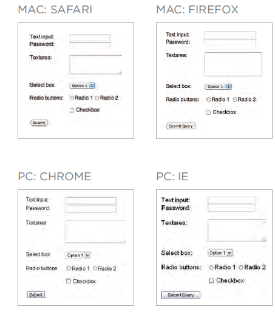

# Form

## Why Forms?
* The best known form on the web is probably the search box that sits right in the middle of Google's homepage.

## Form Controls
* ADDING TEXT:  
    * Text input (single-line)

            <input>
                type="text"
                name
                maxlength
                size

    * Password input

            <input>
                type="password"
                name
                size, maxlength

    * Text area (multi-line)

            <textarea>

* Making Choices:
    * Radio buttons

            <input>
                type="radio"
                name
                value
                checked

    * Checkboxes

            <input>
                type="checkbox"
                name
                value
                checked

    * Drop-down boxes

            <select>
                name
            <option>
                value
                selected
                
* Submitting Forms:
    * Submit buttons
    * Image buttons
* Uploading Files:
    * File upload

 ## Form Structure
           <form>
                action
                method
                id

* Multiple Select Box

                <select>
                        size
                        multiple

* File Input Box

                <input>
                type="file"

* Submit Button

                <input>
                type="submit"
                name
                value

* Image Button

                <input>
                type="image"

* Button & hidden Controls

                <button>
                <input>
                type="hidden"

* Labelling Form Controls

                <label>
                for

* Grouping Form Elements

                <fieldset>
                <legend>

### HTML5: Form Validation
### HTML5: Date Input

                <input>
                type="date"

### HTML5: Email & URL Input

                <input>
                type="email"
                type="url"

### HTML5: Search Input

                <input>
                type="search"
                placeholder

# Lists, Tables and Forms

1. Bullet Point Styles
* list-style-type
                Unordered Lists
                        none
                        disc
                        circle
                        square

                Ordered Lists
                        decimal
                        decimal-leading-zero
                        lower-alpha
                        upper-alpha
                        lower-roman
                        upper-roman

2. Images for Bull ets
* list-style-image

3. Positioning the Marker

* list-style-position

                outside
                inside

4. List Shorthand

                list-style

5. Table Properties

                width
                padding
                text-transform
                letter-spacing, font-size
                border-top, border-bottom
                text-alig
                background-color
                :hover

5. Border on Empty Cells

                empty-cells
                        show
                        hide
                        inherit

6. Gaps Between Cells

                border-spacing, border-collapse
                        collapse
                        separate

7. Styling Forms

8. Styling Text Inputs

                font-size
                color
                        background-color
                border
                        border-radius
                :focus
                :hover
                background-image

9. Styling Submit Buttons

                color
                text-shadow
                border-bottom
                background-color
                :hover

10. Styling Fieldsets & Legends

                width
                color
                background-color
                border
                border-radius 
                padding

11. Aligning Form Controls: Problem

12. Aligning Form Controls: Solution

13. Cursor Styles

                cursor
                        auto
                        crosshair
                        default
                        pointer
                        move
                        text
                        wait
                        help
                        url("cursor.gif");

14. Web Developer Toolbar

                1: Outlines
                2: Structure
                3: CSS styles

---

# EVENTS

## DIFFERENT EVENT TYPES

### UI EVENTS 

|EVENT| DESCRIPTION|
|---|--|
|load| Web page has finished loading|
|unload |Web page is unloading (usually because a new page was requested)|
|error| Browser encounters a JavaScript error or an asset doesn't exist|
|resize |Browser window has been resized|
|scroll |User has scrolled up or down the page|

### KEYBOARD EVENTS

|EVENT| DESCRIPTION|
|--|--|
|keydown |User first presses a key (repeats while key is depressed)|
|keyup |User releases a key|
|keypress| Character is being inserted (repeats while key is depressed)|

### MOUSE EVENTS 

|EVENT |DESCRIPTION|
|--|--|
|click |User presses and releases a button over the same element|
|dblclick| User presses and releases a button twice over the same element|
|mousedown |User presses a mouse button while over an element|
|mouseup |User releases a mouse button while over an element|
|mousemove| User moves the mouse (not on a touchscreen)|
|mouseover |User moves the mouse over an element (not on a touchscreen)|
|mouseout |User moves the mouse off an element (not on a touchscreen)|

### FOCUS EVENTS

|EVENT|DESCRIPTION|
|--|--|
|focus / focusin|Element gains focus|
|blur / focusout|Element loses focus|

### FORM EVENTS

|EVENT|DESCRIPTION|
|--|--|
|input|Value in any `<input>` or `<textarea>` element has changed (IE9+) or any element with the contented i table attribute|
|change|Value in select box, checkbox, or radio button changes ( IE9+)|
|submit|User submits a form (using a button or a key)|
|reset|User clicks on a form's res~t button (rarely used these days)|
|cut|User cuts content from a form field|
|copy|User copies content from a form field|
|paste|User pastes content into a form field|
|select|User selects some text in a form field|

### MUTATION EVENTS*

|EVENT|DESCRIPTION|
|--|--|
|DOMSubtreeModified|Change has been made to document|
|DOMNodelnserted|Node has been inserted as a direct child of another node|
|DOMNodeRemoved|Node has been removed from another node|
|DOMNodelnsertedlntoDocument|Node has been inserted as a descendant of another node|
|DOMNodeRemovedFromOocument|Node has been removed as a descendant of another node|

## How event trigger JavaScript code

1. SELECT ELEMENT
2. SPECIFY EVENT
3. CALL CODE

## THREE WAYS TO BIND AN EVENT TO AN ELEM ENT

1. HTML EVENT HANDLERS
2. TRADITIONAL DOM EVENT HANDLERS
3. DOM LEVEL 2 EVENT LISTENERS

**SUPPORTING OLDER VERSIONS OF IE**

## CHANGING DEFAULT BEHAVIOR
1. preventDefault()
2. stopPropagation()
3. USING BOTH METHODS

## FORM EVENTS
1. submit
2. change
3. input

